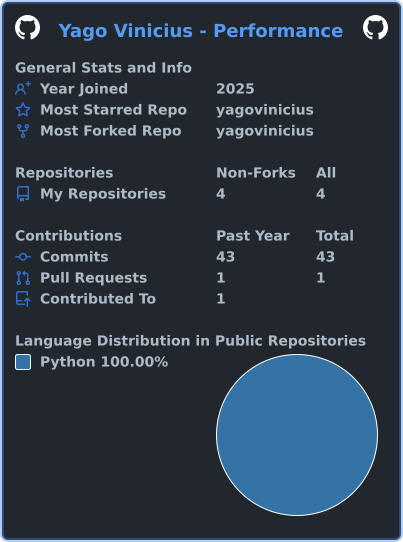

# Olá, sou o Yago | Hi, I'm Yago

<table align="center">
  <tr>
    <td width="50%" valign="top">
      <h3>🇧🇷 Português</h3>
      Arquiteto de Soluções e Analista de Dados. Especialista em converter processos complexos em ecossistemas inteligentes com IA e Automação. 
        
      🎓 <i>IA (GRAN) & Adm (Unialfa)</i>
    </td>
    <td width="50%" valign="top">
      <h3>🇺🇸 English</h3>
      Solutions Architect and Data Analyst. Expert in converting complex processes into intelligent ecosystems using AI and Automation.
        
      🎓 <i>AI Tech & Business Admin</i>
    </td>
  </tr>
</table>

  
  
  
  

---

### 🏆 Projetos em Destaque | Featured Projects

<table align="center">
  <tr>
    <td width="50%" valign="top">
      <b><a href="https://alpha-omniscope.streamlit.app/">AlphaCorp Analytics | Executive Dashboard</a></b> 
      Uma demonstração arquitetural de Engenharia de Software, Data Analytics e Governança de Sessões.  
      🛡️ <i>Arquitetura "Groundhog Day" construída em Python & Streamlit, conectada a um banco Supabase (PostgreSQL) com políticas RLS. Simulação interativa segura com cache efêmero.</i> 
       
      <a href="https://alpha-omniscope.streamlit.app/">Acessar Aplicação</a> | <a href="https://github.com/yagovinicius/alpha-omniscope">Ver Código</a>
    </td>
    <td width="50%" valign="top">
      <b><a href="https://alpha-omniscope.streamlit.app/">AlphaCorp Analytics | Executive Dashboard</a></b> 
      An architectural demonstration of Software Engineering, Data Analytics, and Session Governance.  
      🛡️ <i>"Groundhog Day" architecture built in Python & Streamlit, connected to a Supabase (PostgreSQL) database with RLS policies. Secure interactive simulation with ephemeral cache.</i> 
       
      <a href="https://alpha-omniscope.streamlit.app/">Live App</a> | <a href="https://github.com/yagovinicius/alpha-omniscope">Source Code</a>
    </td>
  </tr>
</table>

---

### 📊 Estatísticas | Stats

  

---

  
  

